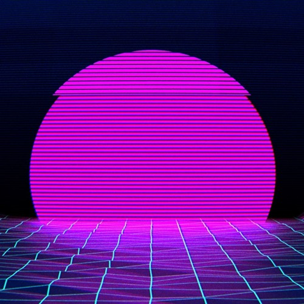
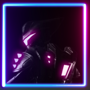

# Ratchet & Clank Lighbox

## Inspiration

For my brother's 21st birthday, I wanted to combine his love of Ratchet & Clank and adding coloured lights to his room to make a custom lightbox for his wall.

He is a big fan of this pink and blue neon style:

He was recently showing me something on his computer and I spotted a profile picture he had made for himself:

My goal is to build a physical representation of this profile picture using a 3D printer, Rasperry Pi Pico and some RGB LEDs.

## Links

[TODOs](TODO.md) | [Logbook](logbook.md)
