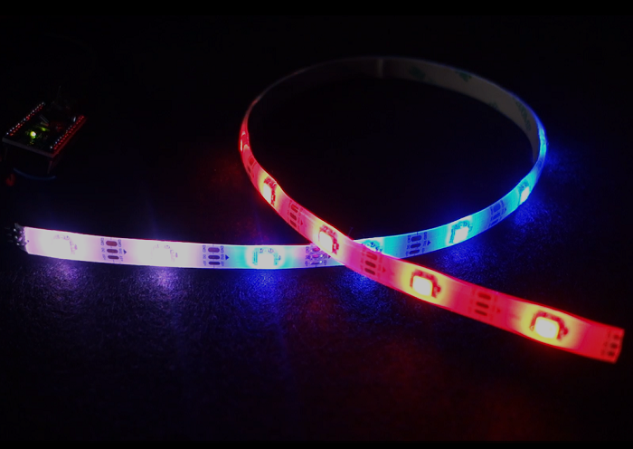

# Monday - 12/09/2022

## LEDs

**Note:** These aren't actually my LEDs but show the kind I am working with.

The next relatively big unknown for me is how to control the WS2812B LED strip I have with a Raspberry Pi Pico. I have confirmed that the strip I have uses 5V for power which is a good start but I have no idea how many LEDs I can drive and at what power.

There seems to be quite a bit of discrepancy in what people are saying online but this seems like a good article to start with: [NeoPixel LEDs][leds].

[leds]: https://learn.adafruit.com/getting-started-with-raspberry-pi-pico-circuitpython/neopixel-leds

## Repository

I also created this repository today to document the journey 😁.

## Jekyll

While this was lower on my priority list, I had some spare time so decided to set up Jekyll for the static site generation for this repo.
